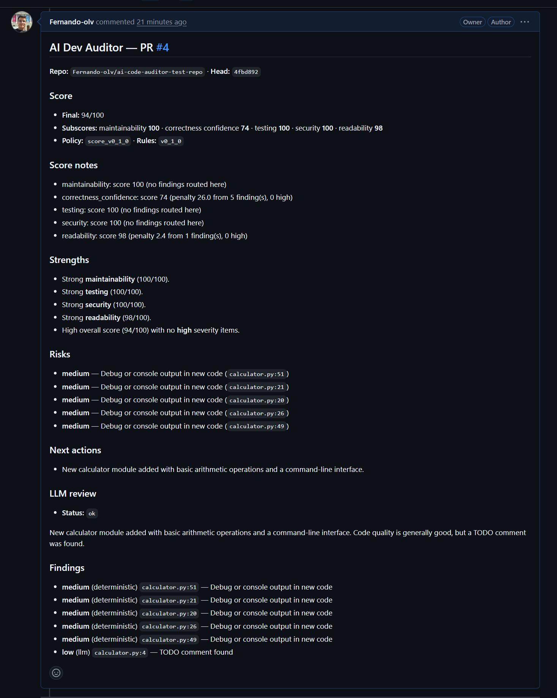
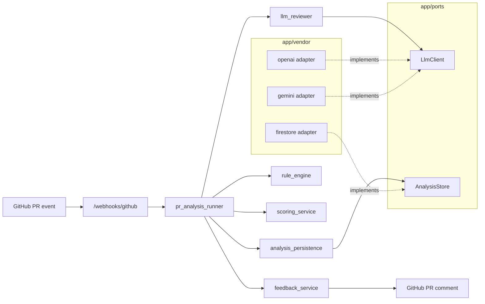

# AI Dev Auditor

An automated **AI-powered code reviewer** that watches your GitHub Pull Requests and posts a single, idempotent review comment combining deterministic rules, an LLM second opinion, and a per-PR risk score. Built as a small FastAPI service deployable to Cloud Run with Firestore for persistence.

> **Status:** MVP. See [docs/EXECUTION_PLAN.md](docs/EXECUTION_PLAN.md) for milestones and [docs/PROGRESS.md](docs/PROGRESS.md) for what is shipped.

---

## What it does

When a Pull Request is opened or updated, the service:

- **Verifies** the GitHub webhook signature (`X-Hub-Signature-256`) and acknowledges fast (HTTP 202).
- **Fetches** PR metadata and the unified diff via the GitHub REST API.
- **Runs deterministic rules** over the diff (size limits, secret patterns, missing-test heuristics, denylisted paths, ...).
- **Asks an LLM** (Google Gemini or any OpenAI-compatible chat API) for a second pass focused on maintainability, correctness, and risks. Output is structured JSON, mapped to the same `Finding` shape as the rule engine.
- **Scores the PR** across maintainability / quality / risk and merges all findings.
- **Persists** the run and findings to Firestore (when configured) for later querying and dashboards.
- **Posts a single markdown comment** on the PR. A hidden head-SHA marker makes the comment idempotent: the next push updates the conversation rather than spamming it.

---

## What you get on a Pull Request

Each analyzed PR receives a comment with a score, ranked findings, and a short LLM summary with strengths, risks, and suggested next actions.

<p align="center">
  
</p>


---

## How it works



The service depends only on the **ports** (`app/ports/`). Concrete vendors live in `app/vendor/` and are picked at runtime by tiny factories in `app/services/`. Adding a new LLM provider or a different storage backend is a single new module under `app/vendor/<name>/` plus a branch in the factory.

---

## Quick start (local)

Requires **Python 3.11+**.

```powershell
python -m venv .venv
.\.venv\Scripts\Activate.ps1
pip install -e ".[dev]"
copy .env.example .env   # then edit values
uvicorn main:app --reload --host 127.0.0.1 --port 8000
```

| Endpoint | Purpose |
| --- | --- |
| `GET /health` | Liveness probe |
| `GET /docs` | Swagger UI (interactive API explorer) |
| `POST /webhooks/github` | Signed GitHub webhook receiver |

To exercise the webhook locally without a public IP, expose `127.0.0.1:8000` with a tunnel (e.g. `cloudflared`, `ngrok`) and point the GitHub webhook at the tunnel URL with the same secret you set in `GITHUB_WEBHOOK_SECRET`.

---

## Configuration

All configuration is environment-driven (see [`.env.example`](.env.example)). On Cloud Run, secrets are mounted from Google Secret Manager.

### Core

| Variable | Required | Default | Notes |
| --- | --- | --- | --- |
| `GITHUB_WEBHOOK_SECRET` | yes | — | Validates `X-Hub-Signature-256` on incoming webhooks. |
| `GITHUB_TOKEN` | yes | — | Bearer token for the GitHub REST API. **Use a classic PAT with `repo` scope** for cross-owner repositories; fine-grained PATs cannot write to repos owned by other users/orgs. |
| `GITHUB_API_BASE_URL` | no | `https://api.github.com` | Override for GitHub Enterprise. |
| `LOG_LEVEL` | no | `INFO` | `DEBUG`/`INFO`/`WARNING`/... |
| `APP_ENV` | no | `development` | Free-form label, surfaced in logs. |

### LLM provider

| Variable | Required | Default | Notes |
| --- | --- | --- | --- |
| `LLM_PROVIDER` | no | `openai` | `openai` or `gemini`. Selects which adapter `app/services/llm_factory.py` builds. |
| `OPENAI_API_KEY` | when `LLM_PROVIDER=openai` | — | Empty value skips LLM review and logs a `skipped` outcome. |
| `OPENAI_BASE_URL` | no | `https://api.openai.com/v1` | Compatible servers (Azure, Together, Groq, vLLM, ...). |
| `LLM_MODEL` | no | `gpt-4o-mini` | OpenAI provider only. |
| `GEMINI_API_KEY` | when `LLM_PROVIDER=gemini` | — | API key from [Google AI Studio](https://aistudio.google.com/) (Generative Language API). Different from Vertex AI. |
| `GEMINI_MODEL` | no | `gemini-2.0-flash` | For free-tier MVPs prefer `gemini-2.5-flash-lite` (more generous quota). The client strips the `models/` prefix automatically. |
| `LLM_MAX_OUTPUT_TOKENS` | no | `2048` | Cap for both providers. |
| `LLM_JSON_RESPONSE_FORMAT` | no | `true` | Sets `response_format=json_object` (OpenAI) or `responseMimeType=application/json` (Gemini). |

### Storage

| Variable | Required | Default | Notes |
| --- | --- | --- | --- |
| `GOOGLE_CLOUD_PROJECT` | for production | — | Enables Firestore persistence. Empty disables persistence (analysis still runs and posts the comment). |
| `FIRESTORE_DATABASE_ID` | no | `(default)` | Override for named databases. |
| `FIRESTORE_EMULATOR_HOST` | local only | — | e.g. `127.0.0.1:8080`. **Do not set on Cloud Run.** |

---

## GitHub setup

1. **Create a Personal Access Token** (classic, scopes: `repo`).
   Fine-grained tokens are not recommended because they can only access repositories owned by you or by orgs that opt in; they will return `403` on any third-party repo.
2. **Create a webhook** on the target repository:
   - Payload URL: `https://<your-cloud-run>.run.app/webhooks/github`
   - Content type: `application/json`
   - Secret: same value as `GITHUB_WEBHOOK_SECRET`
   - Events: select **Pull requests** (or _send me everything_; the service filters).
3. **Permissions required on the token / for the comment author**: `contents: read`, `pull_requests: read`, `issues: write` (PR thread comments use the issues comments API).

Webhook behavior:

- The service responds **`202 Accepted`** with `{"accepted": true, "queued": <bool>}`.
- `queued: true` for actions `opened`, `synchronize`, `reopened` (background analysis runs).
- `queued: false` for other actions (`labeled`, `edited`, `assigned`, ...).
- Duplicate comments for the same head SHA are skipped via the hidden marker `<!-- ai-dev-auditor:head_sha=... -->`.
- If `GITHUB_TOKEN` is empty, analysis is skipped with a structured log line.

---

## Deploy to Google Cloud Run

The repo ships with a `Dockerfile` ready for Cloud Run.

### 1. Enable APIs and create the Firestore database

```powershell
gcloud services enable run.googleapis.com firestore.googleapis.com secretmanager.googleapis.com --project=YOUR_PROJECT_ID
gcloud firestore databases create --location=us-central1 --project=YOUR_PROJECT_ID
```

Grant the Cloud Run runtime service account access to read/write Firestore. The default Compute service account works for an MVP; for production prefer a dedicated SA:

```powershell
gcloud projects add-iam-policy-binding YOUR_PROJECT_ID `
  --member="serviceAccount:<PROJECT_NUMBER>-compute@developer.gserviceaccount.com" `
  --role="roles/datastore.user"
```

### 2. Store secrets in Secret Manager

```powershell
gcloud secrets create github-webhook-secret --replication-policy="automatic" --project=YOUR_PROJECT_ID
gcloud secrets create github-token         --replication-policy="automatic" --project=YOUR_PROJECT_ID
gcloud secrets create gemini-api-key       --replication-policy="automatic" --project=YOUR_PROJECT_ID

# Add a value (PowerShell-safe: avoids trailing newlines)
$tmp = [IO.Path]::GetTempFileName()
[IO.File]::WriteAllBytes($tmp, [Text.UTF8Encoding]::new($false).GetBytes("THE-RAW-SECRET-VALUE"))
gcloud secrets versions add github-webhook-secret --data-file="$tmp" --project=YOUR_PROJECT_ID
Remove-Item $tmp -Force
```

Grant the runtime SA permission to read those secrets:

```powershell
gcloud projects add-iam-policy-binding YOUR_PROJECT_ID `
  --member="serviceAccount:<PROJECT_NUMBER>-compute@developer.gserviceaccount.com" `
  --role="roles/secretmanager.secretAccessor"
```

### 3. Deploy

```powershell
gcloud run deploy ai-code-auditor `
  --source . `
  --region us-central1 `
  --project YOUR_PROJECT_ID `
  --allow-unauthenticated `
  --set-env-vars "GOOGLE_CLOUD_PROJECT=YOUR_PROJECT_ID,LLM_PROVIDER=gemini,GEMINI_MODEL=gemini-2.5-flash-lite" `
  --set-secrets "GITHUB_WEBHOOK_SECRET=github-webhook-secret:latest,GITHUB_TOKEN=github-token:latest,GEMINI_API_KEY=gemini-api-key:latest"
```

Cloud Run will build the container, route requests to `$PORT` automatically, and return a public URL of the form `https://ai-code-auditor-<hash>-<region>.run.app`. Use that URL plus `/webhooks/github` as the GitHub webhook payload URL.

### 4. Verify after deploy

```powershell
# 1. Liveness
Invoke-RestMethod https://<your-service>.run.app/health

# 2. Firestore connectivity (requires ADC)
gcloud auth application-default login
$env:GOOGLE_CLOUD_PROJECT="YOUR_PROJECT_ID"
python scripts/verify_gcp_firestore.py

# 3. End-to-end: push a commit to a PR, then tail logs
gcloud run services logs read ai-code-auditor --region=us-central1 --project=YOUR_PROJECT_ID --limit=80 |
  Select-String -SimpleMatch -Pattern "pr_analysis_llm_outcome","pr_analysis_github_comment_posted"
```

A successful run logs `pr_analysis_llm_outcome { llm_status: ok, ... }` followed by `pr_analysis_github_comment_posted`.

---

## Project structure

```
app/
  api/              FastAPI routers (webhook, health)
  core/             Settings, logging, configuration loaders
  domain/           Pure domain types (Finding, NormalizedPrContext, scoring)
  ports/            Interfaces consumed by services
    llm_client.py       LlmClient Protocol
    analysis_store.py   AnalysisStore Protocol
  vendor/           Concrete adapters (one folder per external service)
    openai/         OpenAI-compatible chat completions adapter
    gemini/         Google AI Studio Gemini generateContent adapter
    firestore/      FirestoreAnalysisStore + client factory
  rules/            Deterministic rule pack (size, secrets, coverage heuristics, ...)
  schemas/          Pydantic models for LLM I/O parsing
  services/         Orchestration (pr_analysis_runner, scoring, factories)
docs/               Plans, progress notes, screenshots
scripts/            Operational helpers (verify_gcp_firestore.py, ...)
tests/              Unit + integration tests
ai/                 Editable system/memory prompts for the reviewer
```

To add a **new LLM provider**: create `app/vendor/<provider>/llm_client.py` implementing the `LlmClient` Protocol, register it in `app/services/llm_factory.py`. Existing services and tests stay untouched.

To add a **new storage backend** (e.g. Postgres, DynamoDB): create `app/vendor/<backend>/analysis_store.py` implementing `AnalysisStore`, then branch in `app/services/store_factory.py`.

---

## Testing & quality

```powershell
pytest -q                  # 88+ unit tests
ruff check .               # lint
ruff format --check .      # format check (no writes)
```

Integration tests against the Firestore emulator are gated by a marker:

```powershell
gcloud beta emulators firestore start --host-port=127.0.0.1:8080
$env:FIRESTORE_EMULATOR_HOST="127.0.0.1:8080"
pytest -m integration
```

CI-equivalent one-liner:

```powershell
ruff check . ; ruff format --check . ; pytest -q
```

---

## Roadmap

Implemented milestones are tracked in [docs/PROGRESS.md](docs/PROGRESS.md). Highlights of what is **already shipped**:

- Signed webhook intake with background-task analysis dispatch.
- Deterministic rule engine with a configurable rule pack.
- LLM reviewer with provider-agnostic adapters (OpenAI-compatible + Google Gemini).
- Atomic Firestore persistence (`analysis_runs` + nested `findings`) with batched writes.
- Idempotent PR comment via head-SHA marker, with markdown rendering of strengths / risks / next actions.
- Cloud Run deploy path with Secret Manager wiring.

Possible next milestones: per-language plugin packs (Go, JS), incremental review on `synchronize` events, dashboard UI over the Firestore data.

---

## License

This project is part of an MVP exploration; license to be determined. Open an issue if you would like to use it commercially.
