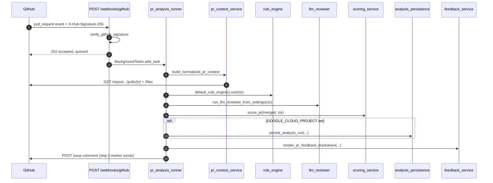
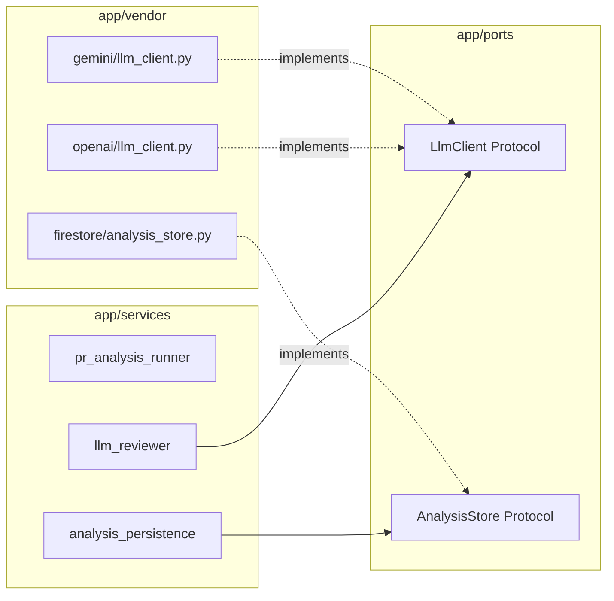

# Architecture

A short, code-anchored tour of how a Pull Request becomes a single review comment. For setup and configuration see [README.md](../README.md); for milestones see [EXECUTION_PLAN.md](EXECUTION_PLAN.md); for the reviewer agent contract see [agents.md](agents.md).

## Design principles

1. **Deterministic logic before probabilistic logic.** Rules run first; the LLM is a second opinion that returns the same `Finding` schema and is merged, never trusted blindly.
2. **Ports and adapters.** Services depend on small Protocols in [`app/ports/`](../app/ports/). Concrete vendors (OpenAI, Gemini, Firestore) live in [`app/vendor/<name>/`](../app/vendor/) and are picked at runtime by tiny factories in [`app/services/`](../app/services/).
3. **Pure domain types.** [`app/domain/`](../app/domain/) holds dataclasses/Pydantic models with no IO: `Finding`, `NormalizedPrContext`, `PrScoreResult`, scoring config. Easy to test, easy to evolve.
4. **One PR snapshot = one analysis run.** Identified by `head_sha`. Re-pushes update the existing thread instead of spamming new comments.
5. **Fail open, log loudly.** Missing token, missing LLM key, partial PR fetch — none of these stop the request path; they degrade gracefully and show up in structured logs.

## Request lifecycle



The fast path (steps 1–3) returns within a few milliseconds; the heavy work (steps 4–10) runs in a FastAPI `BackgroundTasks` so GitHub never sees a slow webhook. The pieces:

| Step | Code | What happens |
| --- | --- | --- |
| 1 | [`app/api/webhook.py`](../app/api/webhook.py) | Reads raw body, verifies HMAC. Unknown event types return `202 ignored`. |
| 2 | [`app/services/webhook_service.py`](../app/services/webhook_service.py) | `parse_pull_request_event` extracts `(action, repo, pr_number, head_sha)`. `pull_request_action_triggers_analysis` whitelists `opened/synchronize/reopened`. |
| 3 | [`app/services/pr_analysis_runner.py`](../app/services/pr_analysis_runner.py) | Orchestrates the rest. Skips with a structured warning if `GITHUB_TOKEN` is missing. |
| 4 | [`app/services/pr_context_service.py`](../app/services/pr_context_service.py) | Builds `NormalizedPrContext` (PR metadata + filtered changed files). Detects head-SHA mismatch and marks the context as `partial_context`. |
| 5 | [`app/services/rule_engine.py`](../app/services/rule_engine.py) + [`app/rules/`](../app/rules/) | Deterministic pack `v0_1_0`: size limits, secret patterns, missing-test heuristics, denylisted paths. Stable `finding_id` via `compute_finding_id`. |
| 6 | [`app/services/llm_reviewer.py`](../app/services/llm_reviewer.py) | Builds prompt from [`ai/prompts/review_prompt.md`](../ai/prompts/review_prompt.md) + memory, calls the `LlmClient` Protocol, parses to the `Finding` shape. Returns `status=ok|skipped|fallback` so callers always get a usable result. |
| 7 | [`app/services/scoring_service.py`](../app/services/scoring_service.py) + [`app/domain/scoring.py`](../app/domain/scoring.py) | Pure function from `(findings, ctx)` to `PrScoreResult`. No randomness, order-invariant. |
| 8 | [`app/services/analysis_persistence.py`](../app/services/analysis_persistence.py) | Optional. Atomic batched write to `analysis_runs/{id}` and `analysis_runs/{id}/findings/*` via the `AnalysisStore` port. |
| 9 | [`app/services/feedback_service.py`](../app/services/feedback_service.py) | Renders the markdown body and appends a hidden head-SHA marker for idempotency. |
| 10 | [`app/services/github_client.py`](../app/services/github_client.py) | `list_issue_comments` → if any body contains the marker, skip. Otherwise `create_issue_comment`. |

## Idempotency

Every comment ends with a hidden HTML marker:

```
<!-- ai-dev-auditor:head_sha=abc1234... -->
```

Defined in [`feedback_service.py`](../app/services/feedback_service.py) (`MARKER_PREFIX`/`append_head_sha_marker`). On every push the runner lists existing PR comments and skips posting if any comment for the current `head_sha` is already present. New pushes produce new SHAs and therefore new comments — the conversation reflects the actual state of the branch without spam.

## Boundaries: ports and vendors



**Adding a new LLM provider**: drop `app/vendor/<name>/llm_client.py` implementing `LlmClient` and add a branch in [`app/services/llm_factory.py`](../app/services/llm_factory.py). No changes to `services/`, `domain/`, or tests for existing providers.

**Adding a new storage backend**: same pattern with `AnalysisStore` and [`app/services/store_factory.py`](../app/services/store_factory.py).

## Data model

`Finding` (from [`app/domain/findings.py`](../app/domain/findings.py)) is the lingua franca between rules, the LLM reviewer, scoring, persistence, and the markdown renderer. Same schema for both sources, with `source: "rule" | "llm"` distinguishing origin. The `agents.md` document defines the wire contract that the LLM reviewer must satisfy.

## Failure modes (intentional)

| Condition | Behavior | Where |
| --- | --- | --- |
| Invalid signature | `401`, no analysis | [`webhook.py`](../app/api/webhook.py) |
| Unknown event | `202 ignored` | [`webhook.py`](../app/api/webhook.py) |
| Action not in `opened/synchronize/reopened` | `202 accepted, queued=false` | [`webhook_service.py`](../app/services/webhook_service.py) |
| `GITHUB_TOKEN` empty | Skip analysis, log `pr_analysis_skipped_missing_github_token` | [`pr_analysis_runner.py`](../app/services/pr_analysis_runner.py) |
| LLM key empty / call fails | `LlmReviewResult(status="skipped"\|"fallback")`, rules-only review still posted | [`llm_reviewer.py`](../app/services/llm_reviewer.py) |
| `GOOGLE_CLOUD_PROJECT` empty | Skip persistence, log `pr_analysis_persistence_skipped_not_configured` | [`pr_analysis_runner.py`](../app/services/pr_analysis_runner.py) |
| Duplicate comment for same `head_sha` | Log `pr_analysis_skip_duplicate_github_comment`, no POST | [`pr_analysis_runner.py`](../app/services/pr_analysis_runner.py) |

These are not bugs to paper over; they are the contract the runner advertises in logs so operators can tell skipped from failed at a glance.
